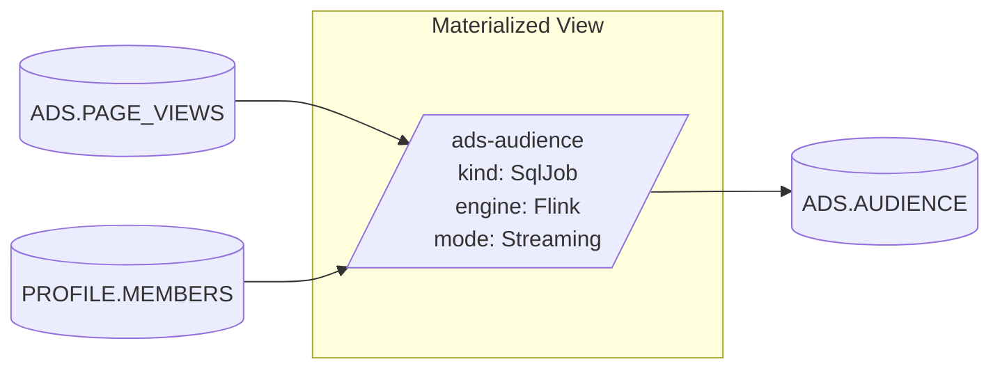

# SQL CLI

`./hoptimator` is the interactive shell — a wrapper around
[sqlline](https://github.com/julianhyde/sqlline) connected to
`jdbc:hoptimator://`. It's the fastest way to explore the catalog, see what a
plan looks like, and create or drop pipelines.

## Launch

From the repo root, after `make build install`:

```bash
./hoptimator
```

The script wraps `sqlline.SqlLine` with Hoptimator's app config, which
registers a few extra commands on top of the standard sqlline ones.

You can pass any sqlline argument through. For example, run a script and exit:

```bash
./hoptimator --run=script.sql
```

To override the JDBC URL, pass `-u`:

```bash
./hoptimator -u "jdbc:hoptimator://k8s.namespace=my-team"
```

See [JDBC driver](jdbc.md) for the full URL syntax.

## Built-in commands

Standard sqlline commands all work (`!help`, `!quit`, `!run`, `!record`,
…) along with the catalog-introspection ones below. Hoptimator also adds
commands to inspect plans, pipelines, and the deployed graph.

| Command       | What it does                                                                  |
| ------------- | ----------------------------------------------------------------------------- |
| `!schemas`    | List every schema in the catalog.                                             |
| `!tables`     | List every table in the catalog.                                              |
| `!intro`      | One-screen tour. Run this first.                                              |
| `!resolve`    | Print the schema and source/sink connector configs Hoptimator would use for a table. |
| `!pipeline`   | Print the auto-generated pipeline SQL for a SELECT or CREATE MATERIALIZED VIEW statement. |
| `!specify`    | Print every Kubernetes spec the statement would deploy. The dry-run for `CREATE MATERIALIZED VIEW`. |
| `!graph`      | Render the deployed dependency graph rooted at an identifier as a Mermaid diagram. |

`!resolve`, `!pipeline`, `!specify`, and `!graph` do not modify any state.
Use them to sanity-check a plan before you let the JDBC driver actually
deploy it (and to inspect what's already running).

### `!resolve <schema.table>`

```sql
0: Hoptimator> !resolve ADS.PAGE_VIEWS
Avro schema:
{ "type": "record", ... }

Source configs:
{connector=datagen, number-of-rows=10, ...}

Sink configs:
{connector=blackhole, ...}
```

Useful for confirming that your TableTemplates are picking up correctly and
producing the connector config you expect.

### `!pipeline <sql>`

```sql
0: Hoptimator> !pipeline CREATE MATERIALIZED VIEW ADS.AUDIENCE AS
                          SELECT FIRST_NAME, LAST_NAME
                          FROM ADS.PAGE_VIEWS NATURAL JOIN PROFILE.MEMBERS

CREATE DATABASE IF NOT EXISTS `ADS` WITH ();
CREATE TABLE IF NOT EXISTS `ADS`.`PAGE_VIEWS` (`PAGE_URN` VARCHAR, `MEMBER_URN` VARCHAR) WITH ('connector'='datagen', 'number-of-rows'='10');
CREATE DATABASE IF NOT EXISTS `PROFILE` WITH ();
CREATE TABLE IF NOT EXISTS `PROFILE`.`MEMBERS` (`FIRST_NAME` VARCHAR, `LAST_NAME` VARCHAR, `MEMBER_URN` VARCHAR, `COMPANY_URN` VARCHAR) WITH ('connector'='datagen', 'number-of-rows'='10');
CREATE DATABASE IF NOT EXISTS `ADS` WITH ();
CREATE TABLE IF NOT EXISTS `ADS`.`AUDIENCE` (`FIRST_NAME` VARCHAR, `LAST_NAME` VARCHAR) WITH ('connector'='blackhole');
INSERT INTO `ADS`.`AUDIENCE` (`FIRST_NAME`, `LAST_NAME`) SELECT `MEMBERS`.`FIRST_NAME`, `MEMBERS`.`LAST_NAME` FROM `ADS`.`PAGE_VIEWS`     INNER JOIN `PROFILE`.`MEMBERS` ON `PAGE_VIEWS`.`MEMBER_URN` = `MEMBERS`.`MEMBER_URN`;
```

This is the literal SQL the engine (Flink, today) will run.

### `!specify <sql>`

```sql
0: Hoptimator> !specify CREATE MATERIALIZED VIEW ADS.AUDIENCE AS
                         SELECT FIRST_NAME, LAST_NAME
                         FROM ADS.PAGE_VIEWS NATURAL JOIN PROFILE.MEMBERS;
apiVersion: flink.apache.org/v1beta1
kind: FlinkSessionJob
metadata:
  name: ads-database-audience
spec:
  deploymentName: basic-session-deployment
  job:
    entryClass: com.linkedin.hoptimator.flink.runner.FlinkRunner
    args:
    - CREATE DATABASE IF NOT EXISTS `ADS` WITH ();
    - CREATE TABLE IF NOT EXISTS `ADS`.`PAGE_VIEWS` (`PAGE_URN` VARCHAR, `MEMBER_URN` VARCHAR) WITH ('connector'='datagen', 'number-of-rows'='10');
    - CREATE DATABASE IF NOT EXISTS `PROFILE` WITH ();
    - CREATE TABLE IF NOT EXISTS `PROFILE`.`MEMBERS` (`FIRST_NAME` VARCHAR, `LAST_NAME` VARCHAR, `MEMBER_URN` VARCHAR, `COMPANY_URN` VARCHAR) WITH ('connector'='datagen', 'number-of-rows'='10');
    - CREATE DATABASE IF NOT EXISTS `ADS` WITH ();
    - CREATE TABLE IF NOT EXISTS `ADS`.`AUDIENCE` (`FIRST_NAME` VARCHAR, `LAST_NAME` VARCHAR) WITH ('connector'='blackhole');
    - INSERT INTO `ADS`.`AUDIENCE` (`FIRST_NAME`, `LAST_NAME`) SELECT `MEMBERS`.`FIRST_NAME`, `MEMBERS`.`LAST_NAME` FROM `ADS`.`PAGE_VIEWS`     INNER JOIN `PROFILE`.`MEMBERS` ON `PAGE_VIEWS`.`MEMBER_URN` = `MEMBERS`.`MEMBER_URN`;
    jarURI: file:///opt/hoptimator-flink-runner.jar
    parallelism: 1
    upgradeMode: stateless
    state: running
```

If you'd `kubectl apply` the output, you'd get the same result as actually
running the `CREATE MATERIALIZED VIEW`. This is the safest way to review what
a statement will do before you run it.

### `!graph <identifier> [--depth N]`

```sql
0: Hoptimator> !graph ADS.AUDIENCE
flowchart LR
    subgraph n0["Materialized View"]
        n1[/"ads-audience
kind: SqlJob
engine: Flink
mode: Streaming"/]
end
    n2[("ADS.PAGE_VIEWS")]
    n3[("PROFILE.MEMBERS")]
    n4[("ADS.AUDIENCE")]
    n2 --> n1
    n3 --> n1
    n1 --> n4
```
Rendered:


Renders the deployed dependency graph rooted at `<identifier>` as Mermaid.
Identifier resolution  runs against Calcite's catalog, so the same names you use in SQL work here:

- A materialized view (`ADS.AUDIENCE`) renders the view's compiled pipeline
  with its direct sources and sink.
- A logical table (`LOGICAL.events`) renders the inter-tier pipelines,
  any owned triggers, and the per-tier physical resources grouped into
  tier subgraphs.
- A physical resource (`KAFKA.events`) traverses the depends-on dependency
  index up to `--depth` hops in each direction — pipelines that read or
  write it, and recursively their other endpoints.

`--depth N` only applies to physical-resource targets; view and logical-table
graphs are intentionally single-hop ("what this view does," not the full
upstream chain). For the chain, run `!graph` on a source identifier.

Rendering backends are pluggable. Mermaid is the default and the only one
shipped today; additional renderers can register via the
`GraphRenderer` SPI — see [Extending Hoptimator](../extending/index.md).

## Running SQL

Hoptimator supports the SQL surface described in
[DDL reference](ddl-reference.md). The headline operations:

```sql
-- Read from any registered table
SELECT * FROM ADS.PAGE_VIEWS LIMIT 5;

-- Define a reusable view (no pipeline)
CREATE VIEW ADS.AUDIENCE AS
  SELECT * FROM ADS.PAGE_VIEWS NATURAL JOIN PROFILE.MEMBERS;

-- Define a materialized view (creates a pipeline)
CREATE MATERIALIZED VIEW ADS.AUDIENCE AS
  SELECT FIRST_NAME, LAST_NAME
  FROM ADS.PAGE_VIEWS NATURAL JOIN PROFILE.MEMBERS;

-- Drop either
DROP VIEW ADS.AUDIENCE;
DROP MATERIALIZED VIEW ADS.AUDIENCE;
```

Identifiers are case-sensitive when quoted with double quotes
(`"PageViewEvent"`). Unquoted identifiers fold to upper case in the default
configuration.

## Connecting to a different Kubernetes context

The CLI uses your active kubeconfig context by default — whatever
`kubectl config current-context` reports. To target a specific namespace, set
it on the JDBC URL:

```bash
./hoptimator -u "jdbc:hoptimator://k8s.namespace=my-team"
```

To use a non-default kubeconfig file:

```bash
./hoptimator -u "jdbc:hoptimator://k8s.kubeconfig=/path/to/config"
```

For the full list of `k8s.*` connection properties (server, token, user,
truststore, impersonation), see [JDBC driver](jdbc.md).

## Tips

- **Multi-line statements** — sqlline waits for a trailing semicolon, so feel
  free to break long DDL across lines.
- **Use `!record` to capture a session.** Useful when filing bug reports.
- **Use `!run` to re-play a script.** The integration tests do this; you can
  too.
- **Tab completion** is available for SQL keywords and registered table
  names — sqlline picks them up automatically once a connection is open.
